# Assignment 2 Report

Course: CSCI 4742 Cybersecurity Programming and Analytics
Name: Meme Chhay
Date: 4/16/2026

---

# Part 1: Advanced Exploitation with Metasploit

## Task 1: Exploiting UnrealIRCd Backdoor

### Screenshots

**Nmap scan identifying UnrealIRCd**
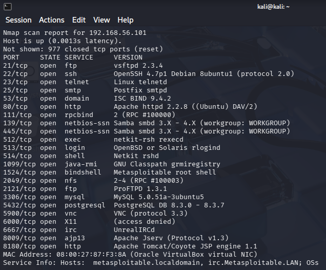

**Metasploit configuration with parameters**
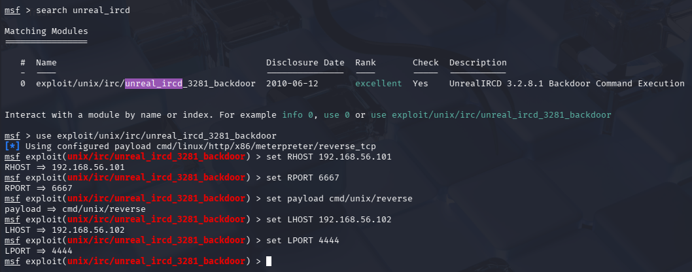

**Command execution and exploit**
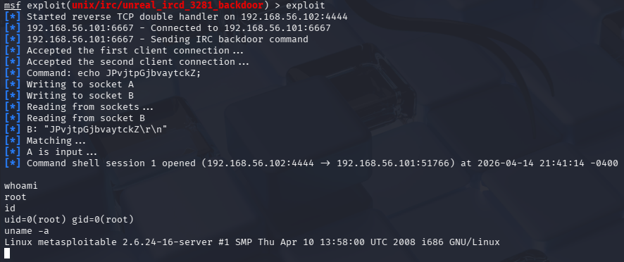 

---

### Analyze UnrealIRCd backdoor exploit and answer these questions.

**How does this backdoor differ from typical software vulnerabilities like buffer overflows or input sanitization flaws?**  
- This backdoor is different because it was intentionally added into the software instead of being caused by a coding mistake. Most vulnerabilities happen due to errors like improper input handling or memory issues, but in this case, the backdoor is built in and gives attackers direct access without needing to exploit a bug.

**Why is the existence of a compiled backdoor in an open-source project so concerning?**  
- It is concerning because open-source software is supposed to be transparent and trusted by the community. If a backdoor is included in the compiled version, users may install it without realizing it is compromised. This can lead to a large-scale supply chain attack affecting many systems at once.

**What security mechanisms (if any) could have prevented the execution of this backdoor?**  
- Security mechanisms like file integrity checks (hashes or digital signatures) could help verify that the software has not been tampered with. In addition, using sandboxing or monitoring tools could limit what the program is allowed to do and help detect suspicious behavior.

**How does the delivery of this exploit violate traditional trust assumptions in network services?**  
- Normally, network services assume that user input is just normal communication and not harmful. This exploit breaks that assumption because it uses input to execute commands on the system, which should not happen in a secure application.

**Suppose the target server had egress filtering or restricted outbound traffic—how would that impact this attack?**  
- If outbound traffic was restricted, it would make it much harder for the attacker to establish a connection back to their system. This could prevent reverse shells or data exfiltration, reducing the impact of the attack.

**What MITRE ATT&CK tactics and techniques does this exploit align with?**  
- This exploit relates to Initial Access (gaining entry into the system), Execution (running commands on the system), and Command and Control (maintaining communication with the compromised system).

**How can an organization detect that this specific backdoor has been exploited?**  
- An organization could detect it by monitoring unusual network activity, checking system and authentication logs, and using file integrity monitoring tools to detect unexpected changes or suspicious behavior.

**How could proper system administration practices reduce the risk of this vulnerability being present?**  
- Keeping systems updated, verifying software sources, and avoiding outdated or unsupported services can reduce the risk. Regular security audits and monitoring can also help catch issues early.

**How does this attack demonstrate the importance of supply chain security in open-source software?**  
- This attack shows that even trusted software can be compromised before it reaches users. It highlights the importance of verifying software integrity and ensuring that the entire supply chain is secure, not just the source code.

---

## Task 2: Exploiting Tomcat Manager Authentication Bypass

### Screenshots

**Nmap scan confirming Tomcat Manager**
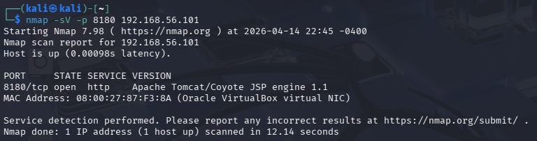 

**Login using default credentials tomcat tomcat**
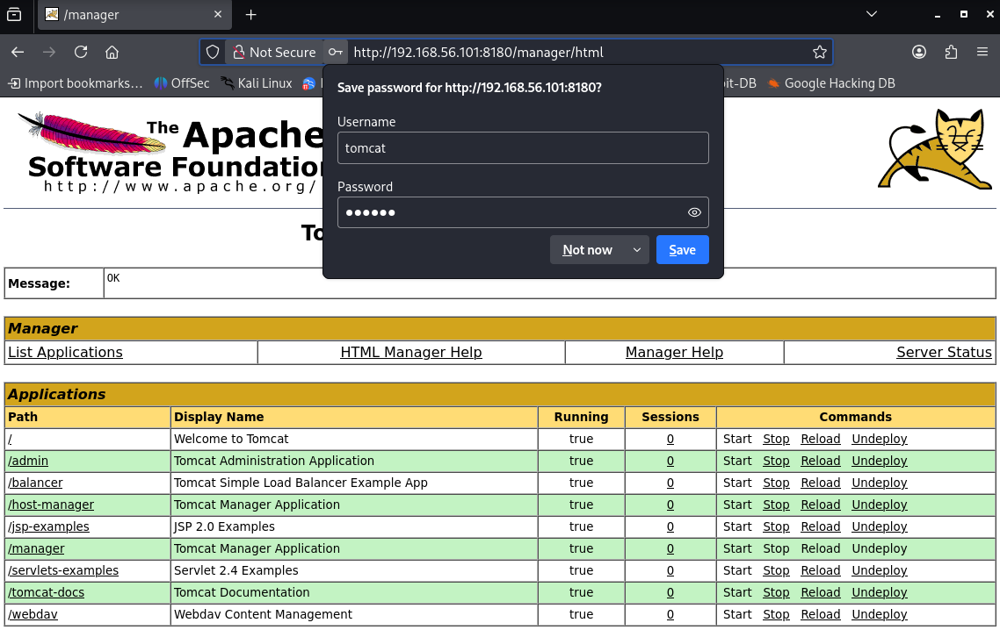

**Meterpreter session showing sysinfo and getuid**
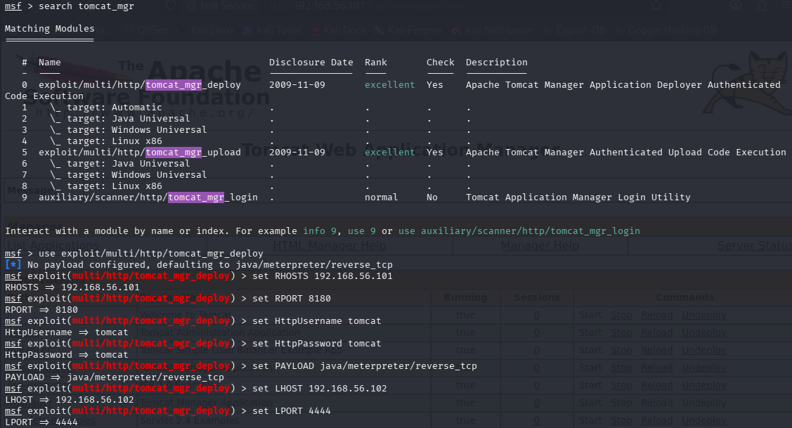
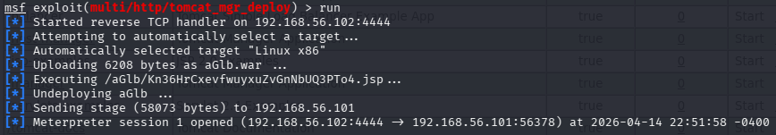 
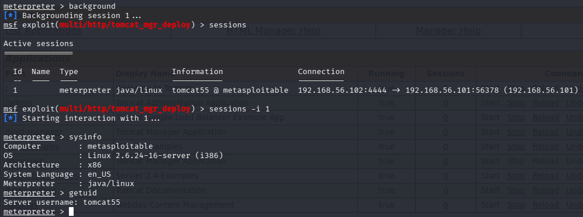 

---

## Tomcat Vulnerability Analyze and Respond

**Why do default credentials pose such a serious security risk in production systems?**  
- Default credentials are a big risk because they are publicly known and often documented online. If they are not changed, attackers can easily log in without needing to guess passwords, which makes it one of the simplest ways to gain access to a system.

**Why is the Tomcat Manager interface so dangerous when misconfigured or left exposed to the internet?**  
- The Tomcat Manager interface is dangerous because it allows users to deploy and manage web applications. If it is exposed and not secured, an attacker can upload a malicious application and execute it, which can give them full control over the server.

**Why does the exploit use a .war (Web Application Archive) file for deploying the payload?**  
- The exploit uses a `.war` file because it is the standard format used by Tomcat to deploy web applications. By uploading a malicious `.war` file, the attacker can run their code directly on the server.

**How does this vulnerability map to real-world attacker behavior in the MITRE ATT&CK framework?**  
- This vulnerability maps to **Initial Access (Exploit Public-Facing Application)** and **Execution (Command Execution)** because the attacker is exploiting a web-facing service to run their own code on the system.

**If this attack succeeds, what could an attacker do next to maintain access or pivot deeper into a network?**  
- After gaining access, the attacker could create backdoors to maintain persistence, try to escalate privileges to gain more control, and move laterally to other systems within the network.

**Why might traditional network defenses fail to prevent this exploit?**  
- Traditional defenses might fail because the attack uses normal HTTP traffic, which is usually allowed through firewalls. Since the traffic looks legitimate, it may not be detected as malicious.

**What mitigation strategies could be implemented beyond just "changing the password"?**  
- In addition to changing default credentials, the Tomcat Manager interface should be disabled if not needed, access should be restricted to specific IP addresses, and multi-factor authentication (MFA) should be used to add an extra layer of security.

**What are the risks of running outdated server software like Tomcat 5.x or 6.x in an enterprise environment today?**  
- Running outdated software is risky because it often contains known vulnerabilities that attackers can easily exploit. These versions no longer receive security updates, which makes systems more vulnerable over time.

---

# Part 2: Memory Corruption in Native C Applications

## Task 1: Stack Protection

### Screenshots
**Commands used to compile both versions: Without Stack Protection (Vulnerable Binary) and With Stack Protection (Hardened Binary)**
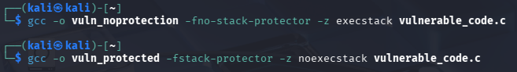

**Buffer overflow triggering in each version: Without Stack Protection (Vulnerable Binary) and With Stack Protection (Hardened Binary)**
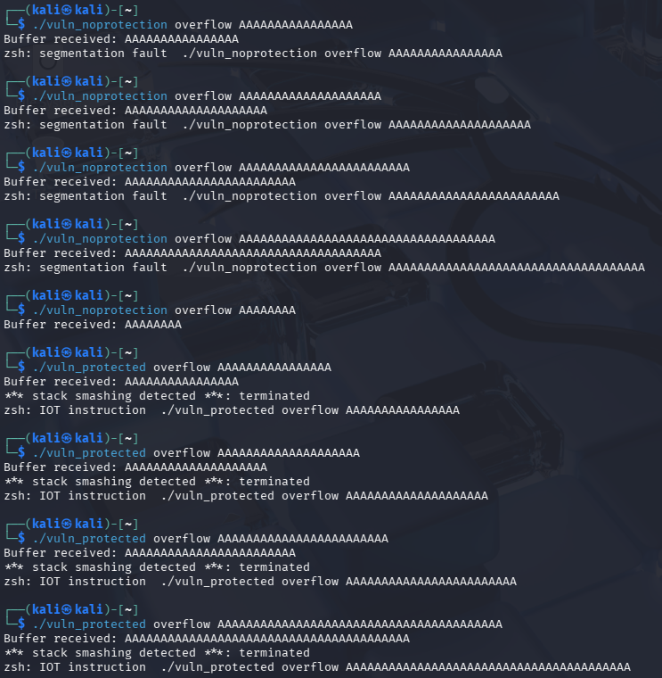  

**Any error messages or segmentation faults. DMESG logs.**
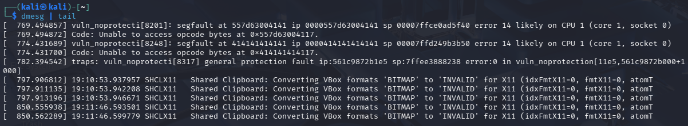

---

## Buffer Overflow and Protection Analyze and Respond

**What role do stack canaries play in stopping a buffer overflow?**  
- Stack canaries act as a protective value placed in memory before the return address. If a buffer overflow happens and overwrites memory, the canary value will change. The program checks this value before returning, and if it is altered, the program stops execution. This helps prevent attackers from overwriting the return address and taking control of the program.

**Why does vuln_protected terminate gracefully while vuln_noprotection crashes?**  
- The protected version uses security features like stack canaries, so when an overflow is detected, the program exits safely instead of continuing. The unprotected version does not have these checks, so when memory is corrupted, it causes a segmentation fault and crashes.

**Does the use of -z execstack make any difference in your tests?**  
- Yes, the `-z execstack` option makes the stack executable, which can allow injected code (like shellcode) to run. Without it, even if an attacker injects code into the stack, it may not execute because the memory is marked as non-executable.

**What would happen if shellcode were included in the overflow string?**  
- If shellcode is included and the stack is executable, the attacker could potentially run their own code on the system. This could lead to gaining a shell or executing commands. However, if protections like stack canaries or non-executable memory are enabled, the attack would likely fail.

**How could an attacker use this vulnerability if stack protection is off?**  
- Without stack protection, an attacker could overwrite the return address and redirect execution to malicious code, such as shellcode. This could allow them to gain control of the program and potentially the system.

**Why does dmesg log vuln_noprotection segmentation fault, but not the vuln_protected error?**  
- The unprotected program crashes due to a segmentation fault, which is logged by the system. The protected program detects the overflow earlier using security checks and exits normally, so it does not generate a segmentation fault message in `dmesg`.

---

## Task 2: Static Analysis

### Screenshots

**Cppcheck output with visible warnings**
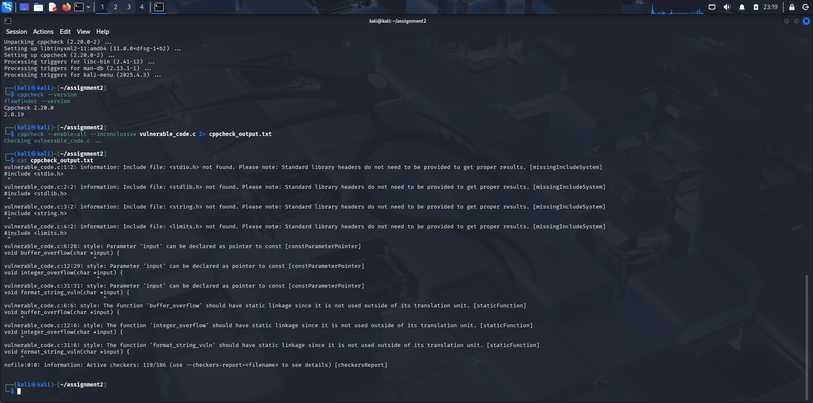

**Flawfinder output with CWE and risk ratings**
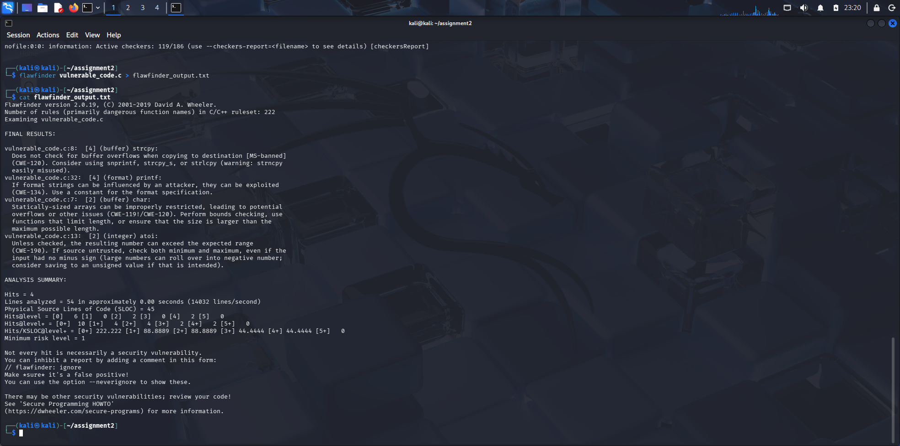

---

### Comparison Table

| Vulnerability Description | Detected by Cppcheck? | Detected by Flawfinder? | CWE Tag(s) (Flawfinder) | Risk Level (Flawfinder) | Notes / Observations |
|---|---|---|---|---|---|
| Use of `strcpy()` (buffer overflow) | No / Partially | Yes | CWE-120 | 4 | Flawfinder directly flags `strcpy()` as unsafe because it does not check destination bounds and can cause a buffer overflow. |
| Use of `atoi()` (integer overflow) | No / Partially | Yes | CWE-190 | 2 | Flawfinder flags `atoi()` because large or malformed numeric input can exceed the expected range and lead to integer overflow or incorrect values. |
| Format string `printf(input)` | No / Partially | Yes | CWE-134 | 4 | Flawfinder identifies `printf(input)` as a format string vulnerability because attacker-controlled input is used as the format string. |
| Fixed-size buffer (`char buffer[10]`) | No | Yes / Indirect | CWE-119 / CWE-120 | 2 | Flawfinder flags the fixed-size local buffer because restricted buffer sizes can contribute to overflow when paired with unsafe copying. |
| Missing includes | Yes (information only) | No | N/A | N/A | Cppcheck reported missing system include information for standard headers, but this is not a security vulnerability and does not affect the main analysis. |

---

## Static Analysis and Code Security Analyze and Respond

**Why do tools like Flawfinder flag strcpy and printf(input) but not always atoi-based overflows?**  
- Tools like Flawfinder flag functions such as `strcpy` and `printf(input)` because they are well-known unsafe functions that can lead to buffer overflows or format string vulnerabilities. However, functions like `atoi` are not always flagged because the risk depends more on how the input is used afterward, which can be harder for automated tools to detect.

**What limitations does Cppcheck have in catching deep memory or type misuse?**  
- Cppcheck can detect many common issues, but it has limitations when it comes to more complex problems like deep memory misuse or type-related bugs. It may not fully understand the program’s logic or how data flows across different parts of the code, so some vulnerabilities can be missed.

**What CWE tags did Flawfinder report, and what do they mean in terms of exploitation risk?**  
- Flawfinder typically reports CWE tags such as CWE-120 (buffer overflow) and CWE-134 (format string vulnerability). These indicate serious risks because they can allow attackers to overwrite memory or execute arbitrary code, potentially leading to full system compromise.

**How would manual code review complement automated static analysis?**  
- Manual code review helps identify issues that automated tools might miss, especially logic errors or context-specific vulnerabilities. By combining both approaches, developers can get a more complete understanding of potential security risks.

**What strategies could you use to improve detection of integer overflows or logic flaws beyond what these tools catch?**  
- To improve detection, you could use additional tools like fuzz testing, enable compiler warnings, and apply secure coding practices. Writing thorough test cases and reviewing how input is handled throughout the program can also help identify issues that automated tools might not catch.

---

## Task 3: Dynamic Analysis

### Screenshots

**AddressSanitizer output (1 for each vulnerability)**
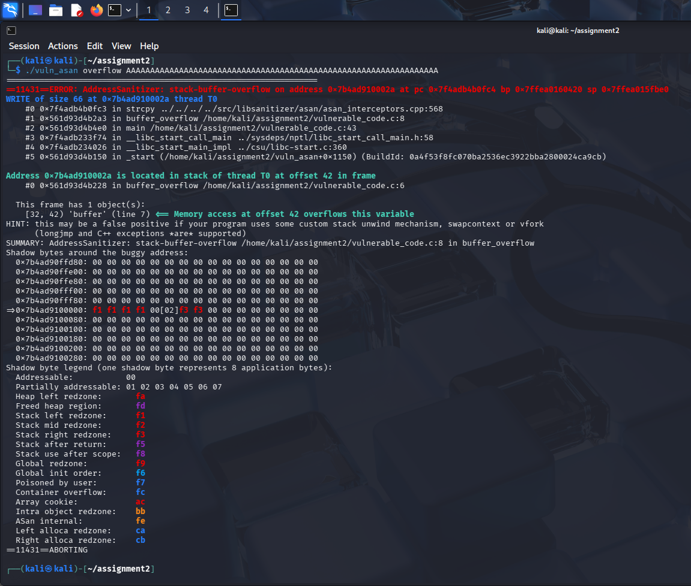
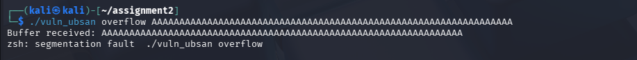
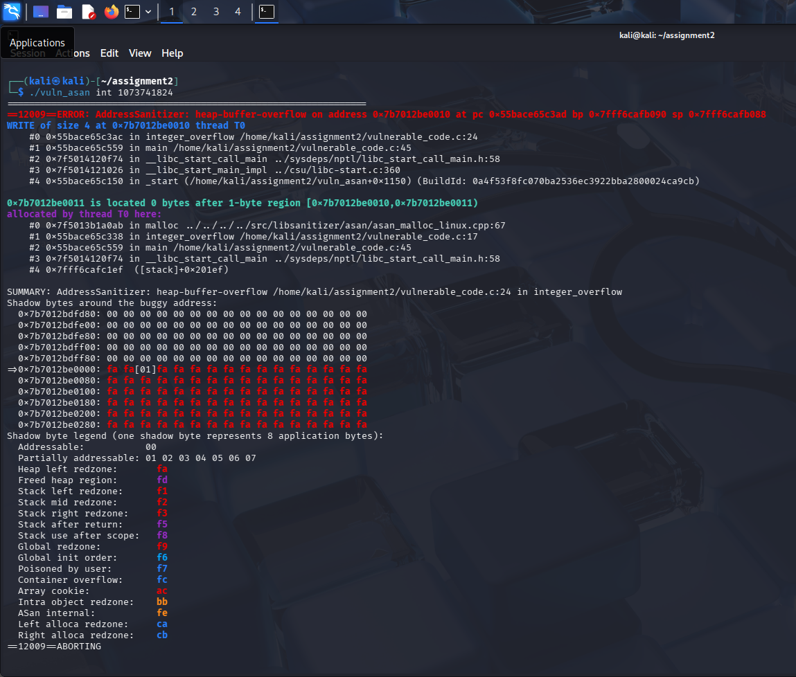
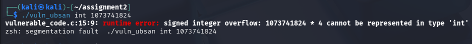
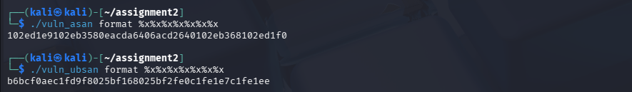

**Valgrind output (1 for each vulnerability)**
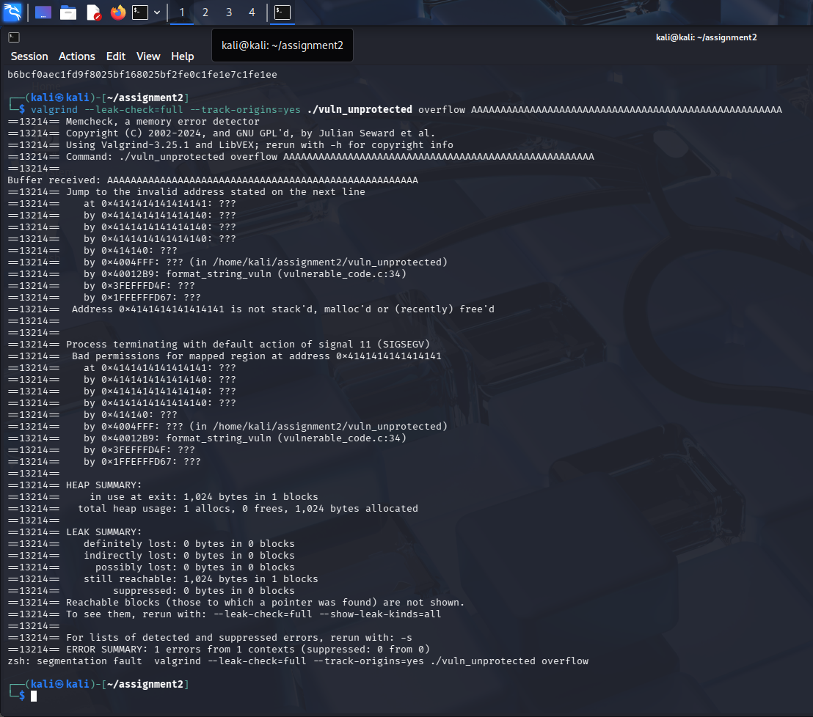
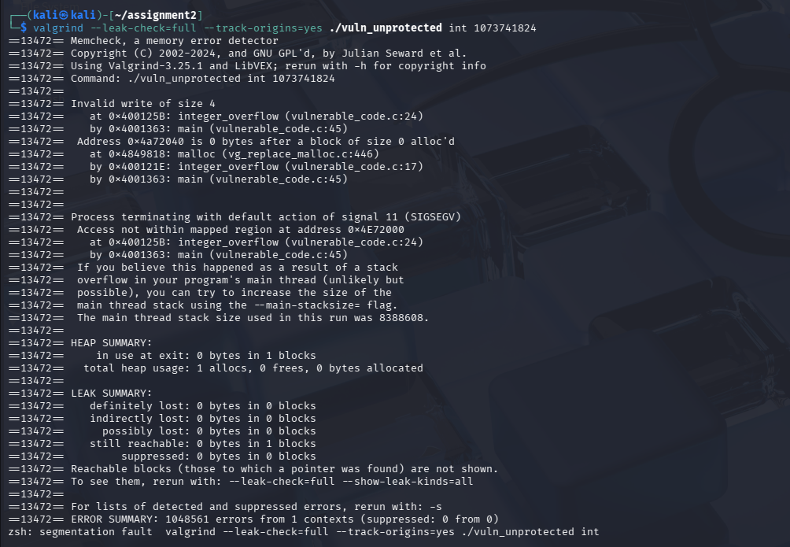
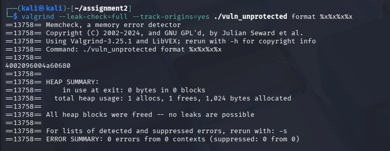

---

### Comparison Table

| Vulnerability Type | Detected by ASan? | ASan Message Summary | Detected by UBSan? | UBSan Message Summary | Detected by Valgrind? | Notes / Observations |
|---|---|---|---|---|---|---|
| Buffer Overflow (`strcpy`) | Yes | Reports `stack-buffer-overflow` in `buffer_overflow()` with stack trace, overflowed variable info, and memory region details. | Partially | Program prints the long buffer and then crashes with a segmentation fault, but UBSan does not clearly label the bug. | Yes | Valgrind reports a jump to an invalid address (`0x414141...`) and process termination with `SIGSEGV`, showing control-flow corruption from the overflow. |
| Integer Overflow (`atoi` + `malloc`) | Yes | Reports `heap-buffer-overflow` in `integer_overflow()` caused by writing past the allocated heap region after the bad size calculation. | Yes | Reports `runtime error: signed integer overflow: 1073741824 * 4 cannot be represented in type 'int'`, then segfaults. | Yes | Valgrind reports `Invalid write of size 4` and shows the write occurred just past a 0-byte allocated block, revealing downstream heap misuse. |
| Format String (`printf(input)`) | No | No sanitizer error; the program simply prints attacker-controlled hex values. | No | No UBSan warning; the program just prints stack-like hex values. | No | Valgrind reports `0 errors from 0 contexts`; the format string flaw is not detected because it does not necessarily trigger illegal memory access in this run. |

---

## Dynamic Analysis Tools Comparison Analyze and Respond

**Which tool gave clearer diagnostics for each vulnerability? Which tool missed each vulnerability? Why?**  
- Tools like AddressSanitizer (ASan) and Valgrind generally gave clearer diagnostics for memory-related issues because they provide detailed information about invalid memory access and where it occurred. UBSan was helpful for undefined behavior but not as detailed for memory issues. Some vulnerabilities were missed because each tool focuses on specific types of problems, so they may not detect issues outside their scope.

**Why do all three tools (ASan, UBSan, Valgrind) fail to detect the format string vulnerability?**  
- These tools focus on memory errors and undefined behavior, not on logical vulnerabilities like format string issues. A format string vulnerability does not always cause a crash or invalid memory access, so it can go undetected by these tools.

**Was one tool better at identifying heap vs. stack issues?**  
- ASan was generally better at identifying both heap and stack issues quickly, especially during runtime. Valgrind was also effective but slower. Both tools can detect these issues, but ASan is usually more efficient and easier to interpret.

**Would you use all these tools together? Why or why not?**  
- Yes, I would use all of them together because each tool detects different types of issues. Using multiple tools provides better coverage and increases the chances of finding more vulnerabilities.

**How do these tools help developers beyond catching crashes (e.g., explaining memory layout, invalid access causes)?**  
- These tools help developers understand how memory is being used and where errors occur. They provide detailed reports that show the cause of invalid memory access, which makes debugging easier. They also help developers learn how their program behaves at runtime and improve overall code quality.

---

## Task 4: Mitigation Recommendations and Secure Refactoring

### Root Cause Analysis

### Screenshots

**Refactor All Three Vulnerable Functions**
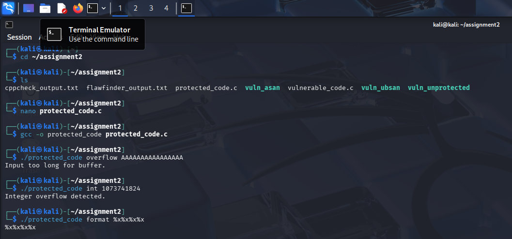

---

## Step 4: Defensive Compiler Options

### Mitigation: Stack Canaries

**Purpose and Protection:**
- Stack canaries protect against **stack-based buffer overflow attacks**.
- They specifically defend against overwriting the **return address** and other control-flow data on the stack.

**How It Works Internally:**
- The compiler inserts a secret value (canary) between local variables and critical stack data.
- Before a function returns, the program checks if the canary value has changed.
- If the canary is modified, the program terminates immediately to prevent exploitation.

**How to Enable or Disable in GCC:**
- Enabled by: `-fstack-protector`
- Disabled by: `-fno-stack-protector`

**Limitations:**
- Does not protect **heap memory** or non-stack data.
- Can be bypassed in advanced attacks if the canary value is leaked or not overwritten.
- Does not prevent all types of memory corruption.

---

### Mitigation: Non-Executable Stack (NX)

**Purpose and Protection:**
- Prevents execution of injected code placed on the stack.
- Defends against **code injection attacks**, such as classic shellcode execution.

**How It Works Internally:**
- The stack memory region is marked as **non-executable**.
- Even if malicious code is injected into the stack, the CPU will not execute it.

**How to Enable or Disable in GCC:**
- Enabled by: `-z noexecstack`
- Disabled by: `-z execstack`

**Limitations:**
- Does not stop **buffer overflows themselves**, only prevents executing injected code.
- Attackers can still use techniques like **return-oriented programming (ROP)**.
- Does not protect against logic or format string vulnerabilities.

---

## Analyze and Respond

**1. Why are memory-safe languages (like Rust or Go) gaining adoption in security-critical systems?**
- Memory-safe languages reduce entire classes of vulnerabilities such as buffer overflows, use-after-free bugs, and invalid memory access. They enforce strict memory safety rules at compile time or runtime, which prevents many common security flaws from occurring. This makes systems more reliable and significantly reduces the risk of exploitation, especially in security-critical environments.

**2. Why do developers continue to use C despite well-known memory safety risks?**
- C is still widely used because it provides high performance, low-level hardware control, and minimal overhead. It is essential for operating systems, embedded systems, and performance-critical applications. Additionally, many large legacy systems are written in C, and rewriting them in safer languages is costly and complex. Developers often rely on secure coding practices and analysis tools instead of abandoning C entirely.

**3. How does secure memory handling relate to the secure software development lifecycle (SSDLC)?**
- Secure memory handling is a critical part of the SSDLC because it helps prevent vulnerabilities early in development. During design and implementation, developers should use safe functions, validate input, and avoid unsafe memory operations. Static and dynamic analysis tools are used during development and testing to detect issues before deployment. This reduces the risk of vulnerabilities reaching production systems.

**4. How could early use of static and dynamic analysis tools help prevent such issues in larger codebases?**
- Using static and dynamic analysis tools early allows developers to detect vulnerabilities before they become deeply embedded in the codebase. Static analysis identifies risky functions and patterns during coding, while dynamic analysis detects actual runtime issues such as memory corruption and undefined behavior. Early detection reduces debugging time, lowers development costs, and improves overall software security in large projects.

---

# Part 3: Web Exploitation with Mutillidae

## Task 1: SQL Injection

### Screenshots
**Login Bypass Using SQLi**
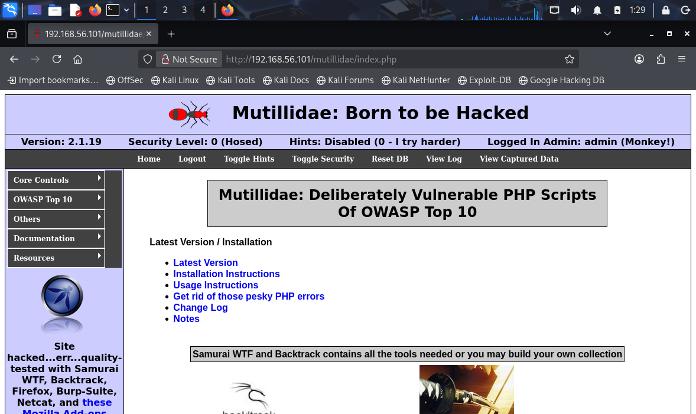  

---

### Analyze and Respond

**Which input field is injectable?**
- The username field is injectable, as entering SQL payloads in this field successfully bypasses authentication.

**What part of the SQL query was manipulated?**
- The WHERE clause of the SQL query was manipulated, specifically the username condition.

**Why does a condition like '1'='1' always succeed?**
- Because it is a boolean expression that always evaluates to TRUE, making the entire WHERE condition TRUE and allowing access without valid credentials.

**What type of SQL Injection did you exploit (e.g., Boolean-based, error-based)?**
- This is a Boolean-based SQL Injection, as it relies on injecting conditions that evaluate to TRUE to manipulate application logic.

**What are the signs of successful exploitation?**
- Login succeeds without valid credentials
- Application grants access or redirects
- No authentication error is shown

**What limitations exist in this type of injection (e.g., data extraction, visibility, input sanitization)?**
- Does not directly extract database data
- Depends on visible responses (login success/failure)
- May fail if input is sanitized or parameterized

**Suggest at least two mitigation strategies (e.g., prepared statements) and explain why they are effective.**
- (1) Prepared Statements (Parameterized Queries): Prevent user input from being interpreted as SQL code.
- (2) Input Validation and Sanitization: Reject or escape special SQL characters like ', --, #.

---

## Task 2: Command Injection

### Screenshots

**Command Injection**
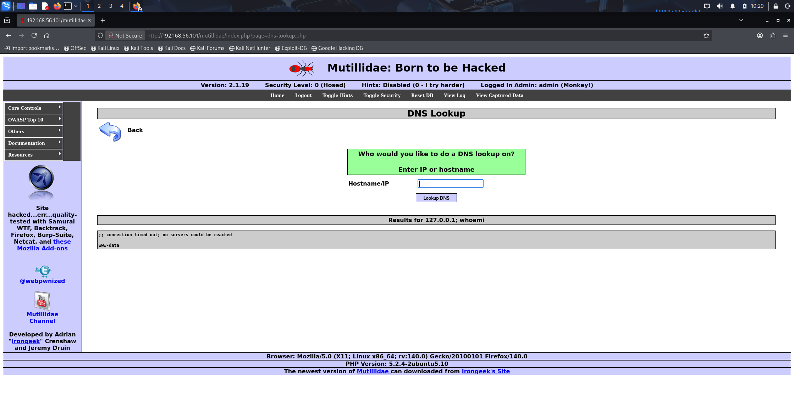  

---

### Analyze and Respond

**What type of command injection did you observe—reflected or blind?**
- The command injection observed was reflected because the output of the injected commands, such as whoami, was directly displayed on the web page. This made it easy to see that the attack was successful.

**Were some command separators (e.g., ;, &&, ||) blocked or filtered?**
- Some command separators seemed to be filtered or less reliable, but others like ; worked successfully. This suggests that input validation was not properly implemented.

**Could this vulnerability be used for privilege escalation, persistence, or lateral movement?**
- Yes, this vulnerability could be used for all three. An attacker could try to escalate privileges if there are system weaknesses, create backdoors for persistence, or move laterally across the network by accessing other systems.

**What are two server-side input validation techniques that could prevent this attack?**
- Two techniques are whitelist validation and input escaping. Whitelist validation ensures that only valid inputs like IP addresses or domain names are accepted, while input escaping prevents special characters from being interpreted as part of a system command.

---

## Task 3: Cross-Site Scripting
## Part A: Reflected XSS

### Screenshots

**Reflected XSS Alert**
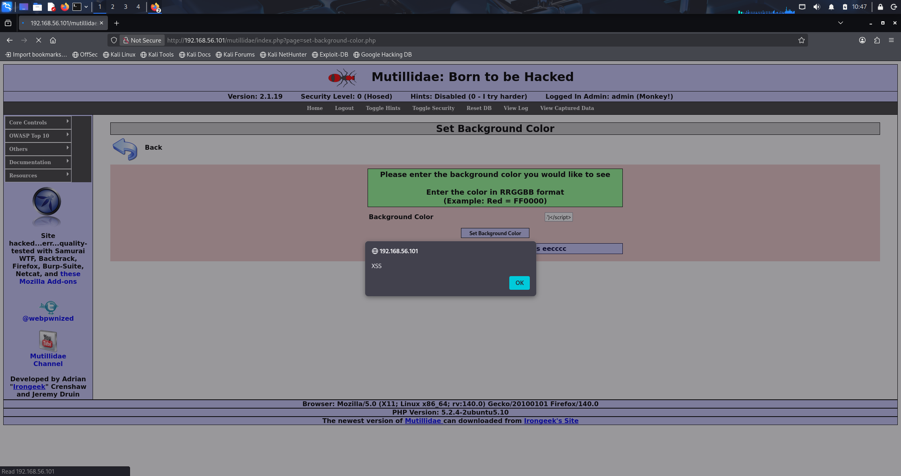 

**Stored XSS Payload**
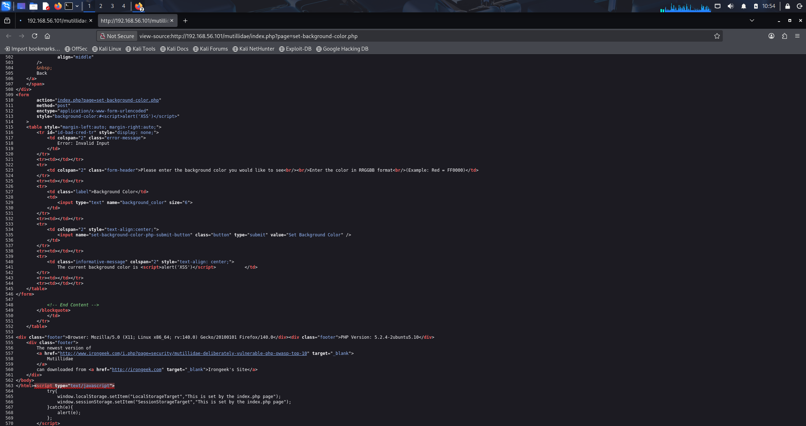 

---

### Analyze and Respond

**Which input field reflected your script?**
- The script was reflected through the Background Color input field, where the user input was directly inserted into the page without any filtering.

**Where in the page source did the payload appear?**
- The payload appeared in the HTML source within the line that displays the current background color, specifically where it shows the user’s input. It was inserted directly into the page without being sanitized or escaped.

**What could an attacker do beyond triggering a popup?**
- Beyond triggering a popup, an attacker could steal session cookies, redirect users to malicious websites, or run scripts that perform actions on behalf of the user, such as changing account information or accessing sensitive data.

---
## Task 3: Cross-Site Scripting
## Part B: Stored XSS (Cookie Stealing)

### Screenshots
**Payload Visible in the Blog Post or Executed Automatically**
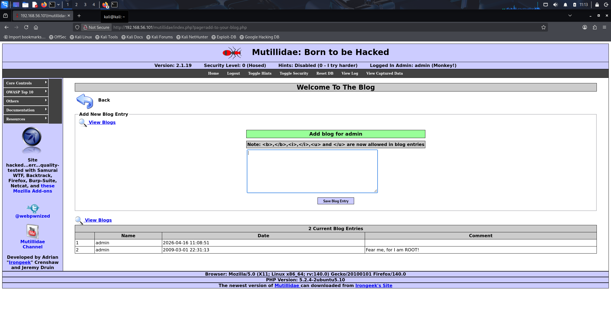
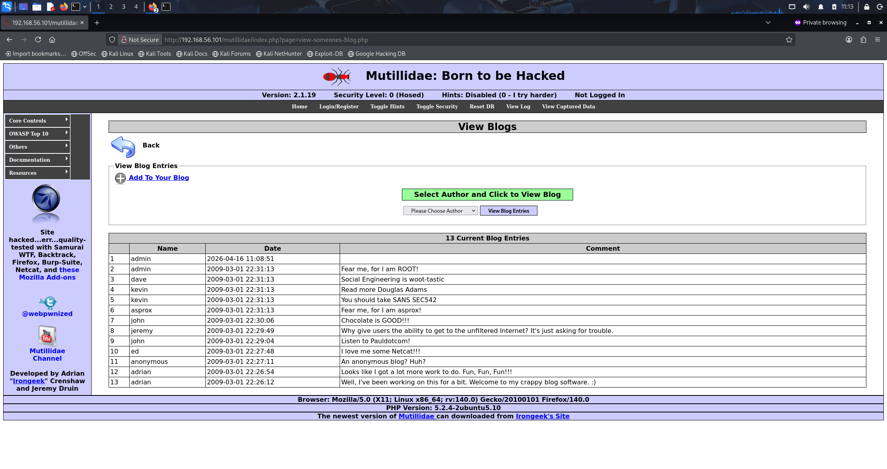  

**Stolen Cookie or Captured HTTP Request in the Kali Listener**
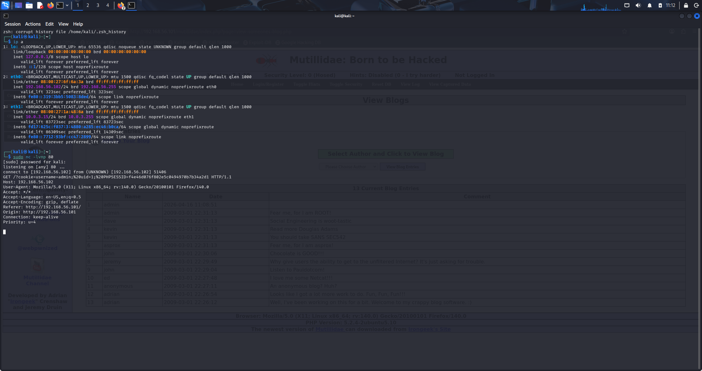 

## Analyze and Respond 
**What allowed the script to persist across page loads?**
- The script persisted because the application stored user input in the database without sanitizing or filtering it. As a result, the malicious script was saved and executed every time the blog page was loaded.

**What actions could an attacker perform after stealing a session cookie?**
- An attacker could hijack the user’s session and gain unauthorized access to their account. They could impersonate the user, access sensitive information, and perform actions on their behalf without needing to log in.

**How would the SameSite=Strict cookie attribute prevent this?**
- The SameSite=Strict attribute prevents cookies from being sent with cross-site requests. This helps reduce the risk of session hijacking because the attacker’s request would not include the victim’s session cookie, making it harder to steal or reuse it.
---

# Part 4: Vulnerability Scanning and Analysis
## Task 1: Nmap Scans

### Screenshots

**Full Nmap Scan**
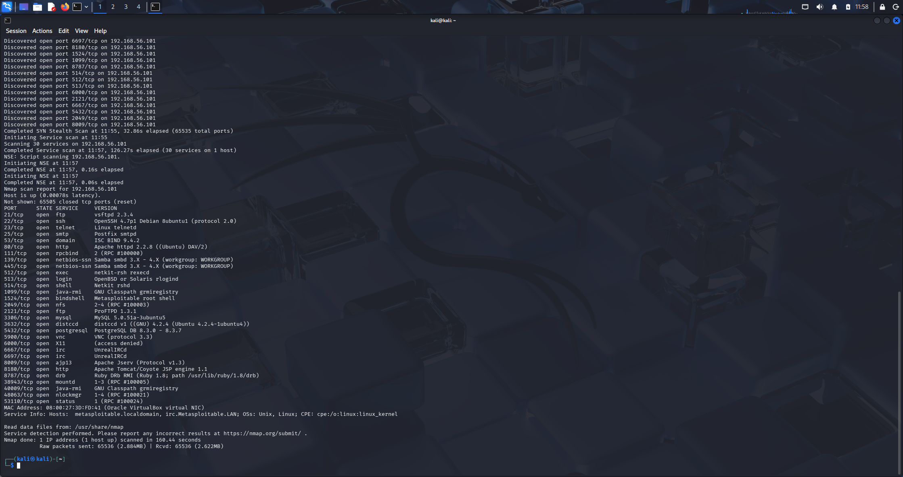 

**Vuln Script Output**
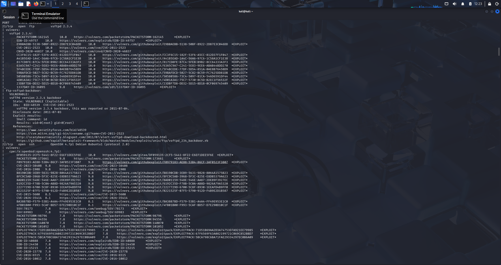 
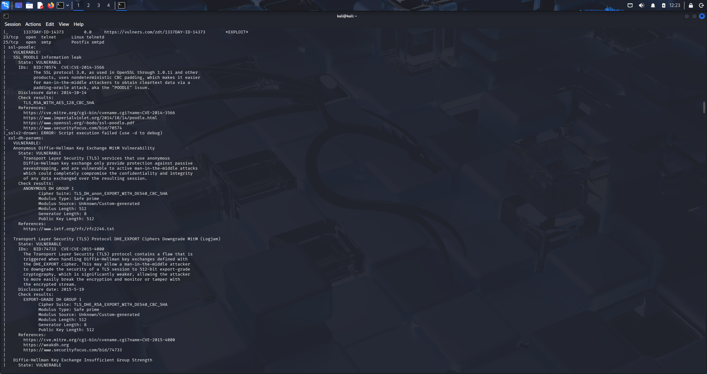 
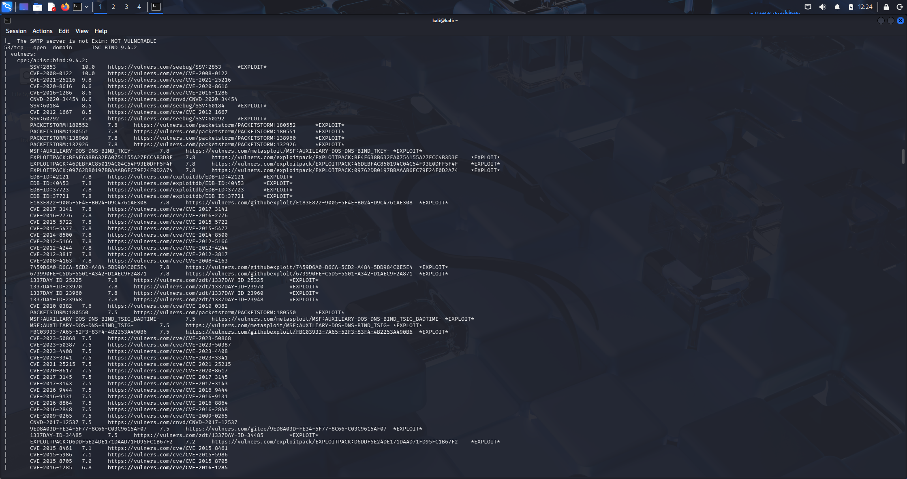 

---

### Analyze and Respond
**Highlight Services with Known Vulnerabilities.**
- The Nmap scan identified multiple open ports and vulnerable services on the Metasploitable-2 machine. Services such as FTP, SSH, SMTP, and DNS were detected, along with several known vulnerabilities including the vsFTPd backdoor (CVE-2011-2523), SSL POODLE (CVE-2014-3566), and Logjam (CVE-2015-4000). These results indicate that the system is highly vulnerable to exploitation.

---

## Task 2: Technical Analysis
## Objective: Select five vulnerabilities from Nmap results and provide in-depth technical analysis.
## Task 2: Identify and Analyze Five Vulnerabilities

### 1. vsFTPd Backdoor

**Service Information**  
- Service: FTP (vsftpd 2.3.4)  
- Port: 21  

**CVE Details**  
- CVE: CVE-2011-2523  
- CVSS: 9.8 (Critical)  
- Type: Backdoor / Remote Code Execution  

**Description**  
- This version of vsFTPd contains a malicious backdoor that allows an attacker to gain shell access by sending a specially crafted username. Once triggered, it opens a remote shell on the target system.

**Exploitability**  
- A Metasploit module (`vsftpd_234_backdoor`) is available. This exploit grants root-level access to the system.

**Example Exploit Path**  
- An attacker connects to the FTP service, triggers the backdoor, gains a shell, and obtains full control of the system including file access and command execution.

### 2. SSL POODLE Vulnerability

**Service Information**  
- Service: SSL/TLS (SMTP or other services)  
- Port: 25  

**CVE Details**  
- CVE: CVE-2014-3566  
- CVSS: 7.5 (High)  
- Type: Cryptographic Attack  

**Description**  
- The POODLE attack exploits SSL 3.0 weaknesses to decrypt encrypted traffic. Attackers can perform a man-in-the-middle attack to recover sensitive data such as session cookies.

**Exploitability**  
- Requires a man-in-the-middle position. Allows exposure of sensitive encrypted data.

**Example Exploit Path**  
- An attacker intercepts network traffic, forces an SSL downgrade, and decrypts communications to steal sensitive information.

### 3. Logjam Vulnerability

**Service Information**  
- Service: TLS/SSL  
- Port: 25  

**CVE Details**  
- CVE: CVE-2015-4000  
- CVSS: 7.4 (High)  
- Type: Cryptographic Weakness  

**Description**  
- The Logjam vulnerability allows attackers to downgrade encryption strength and exploit weak Diffie-Hellman parameters, making it easier to decrypt secure communications.

**Exploitability**  
- Requires a man-in-the-middle attack. Allows decryption of secure sessions.

**Example Exploit Path**  
- An attacker intercepts traffic, forces weaker encryption, and decrypts communication between the client and server.

### 4. OpenSSH Vulnerabilities (Outdated Version)

**Service Information**  
- Service: SSH (OpenSSH 4.7p1)  
- Port: 22  

**CVE Details**  
- CVE: CVE-2016-10012  
- CVSS: ~7.8 (High)  
- Type: Multiple vulnerabilities (information disclosure, privilege issues)  

**Description**  
- The outdated OpenSSH version contains multiple known vulnerabilities that may allow attackers to exploit weaknesses in authentication or system handling.

**Exploitability**  
- Some exploits exist depending on configuration. May allow unauthorized access or information leakage.

**Example Exploit Path**  
- An attacker may attempt brute force or exploit known weaknesses to gain access to the system via SSH.

### 5. BIND DNS Vulnerabilities

**Service Information**  
- Service: DNS (ISC BIND 9.4.2)  
- Port: 53  

**CVE Details**  
- CVE: CVE-2008-0122  
- CVSS: ~8.0 (High)  
- Type: Denial of Service / Remote Exploit  

**Description**  
- This version of BIND contains known vulnerabilities that can allow attackers to crash the DNS service or potentially execute malicious code.

**Exploitability**  
- Exploit-db and Metasploit modules are available. Can disrupt service or lead to further compromise.

**Example Exploit Path**  
- An attacker sends crafted DNS requests to crash the service or exploit memory handling flaws.

---

## Task 3: CWE Classification and Impact Analysis

### 1. vsFTPd Backdoor

**CWE ID:** 
- CWE-284 (Improper Access Control)  

**Explanation:**  
- This vulnerability exists because unauthorized users can gain access to the system through a hidden backdoor without proper authentication.

**Impact:**  
- This can lead to full system compromise, including unauthorized access, data theft, and complete control of the server.

### 2. SSL POODLE Vulnerability

**CWE ID:** 
- CWE-310 (Cryptographic Issues)  

**Explanation:**  
- The vulnerability is caused by the use of outdated SSL 3.0 encryption, which is insecure and allows attackers to decrypt sensitive information.

**Impact:**  
- Attackers can intercept and decrypt sensitive data such as login credentials and session cookies, leading to loss of confidentiality.

### 3. Logjam Vulnerability

**CWE ID:** 
- CWE-326 (Inadequate Encryption Strength)  

**Explanation:**  
- The system uses weak Diffie-Hellman parameters, allowing attackers to downgrade encryption strength and break secure communications.

**Impact:**  
- This can result in attackers decrypting secure traffic, compromising sensitive data and communication integrity.

### 4. OpenSSH Vulnerabilities

**CWE ID:** 
- CWE-119 (Improper Restriction of Operations within Memory Buffer)  

**Explanation:**  
- Some vulnerabilities in older OpenSSH versions involve improper handling of memory, which can lead to potential exploitation.

**Impact:**  
- Attackers may exploit these weaknesses to gain unauthorized access, execute code, or cause system instability.

### 5. BIND DNS Vulnerabilities

**CWE ID:** 
- CWE-400 (Uncontrolled Resource Consumption)  

**Explanation:**  
- The vulnerability allows attackers to send malicious DNS requests that consume system resources or crash the service.

**Impact:**  
- This can lead to denial of service (DoS), making the DNS server unavailable and disrupting network operations.
---

## Task 4: MITRE ATT&CK Mapping

### 1. vsFTPd Backdoor (CVE-2011-2523)

**Tactic:** 
- Initial Access  

**Technique:** 
- T1190 – Exploit Public-Facing Application  

**Explanation:**  
- An attacker can exploit the vsFTPd backdoor vulnerability through the publicly accessible FTP service. By sending a specially crafted request, the attacker gains unauthorized access to the system and can execute commands remotely.

### 2. BIND DNS Vulnerability (CVE-2008-0122)

**Tactic:** 
- Impact  

**Technique:** 
- T1499 – Endpoint Denial of Service  

**Explanation:**  
- An attacker can exploit the BIND DNS vulnerability by sending malicious DNS requests that overwhelm or crash the service. This disrupts availability and prevents legitimate users from accessing network resources.

---

## Task 5: Mitigation Strategies

### 1. vsFTPd Backdoor (CVE-2011-2523)

**Technical Control:**  
- Update or replace the vulnerable vsFTPd version and disable the FTP service if not required.

**Administrative Control:**  
- Implement a patch management policy to ensure all services are regularly updated.

**Type of Control:**  
- Preventive

### 2. SSL POODLE (CVE-2014-3566)

**Technical Control:**  
- Disable SSL 3.0 and enforce the use of secure protocols such as TLS 1.2 or higher.

**Administrative Control:**  
- Establish security policies that require strong encryption standards.

**Type of Control:**  
- Preventive

### 3. Logjam Vulnerability (CVE-2015-4000)

**Technical Control:**  
- Configure servers to use strong Diffie-Hellman parameters and disable weak cipher suites.

**Administrative Control:**  
- Regularly review and update cryptographic configurations.

**Type of Control:**  
- Preventive

### 4. OpenSSH Vulnerabilities

**Technical Control:**  
- Upgrade OpenSSH to a secure version and disable root login over SSH.

**Administrative Control:**  
- Enforce strong password policies and monitor login attempts.

**Type of Control:**  
- Preventive / Detective

### 5. BIND DNS Vulnerability (CVE-2008-0122)

**Technical Control:**  
- Update BIND to a secure version and restrict access using firewall rules.

**Administrative Control:**  
- Implement network segmentation and restrict DNS access to trusted systems.

**Type of Control:**  
- Preventive / Corrective

---

## Analyze and Respond
**How does vulnerability scanning help in reducing attack surface?**
- Vulnerability scanning helps identify open ports, outdated services, and known vulnerabilities. By discovering these weaknesses early, organizations can fix them before attackers exploit them, thereby reducing the overall attack surface.

**What risks arise from false positives/negatives in automated tools like Nmap?**
- False positives may report vulnerabilities that do not actually exist, leading to wasted time and effort. False negatives are more dangerous because they miss real vulnerabilities, giving a false sense of security and leaving systems exposed.

**If you were a system admin, what defense-in-depth measures would you deploy for services exposed to the internet?**
- I would implement multiple layers of security, including firewalls to restrict access, intrusion detection systems to monitor activity, regular patching of software, strong authentication methods, and network segmentation to limit the spread of attacks.

---
