# Assignment 3 Report  
CSCY 4742 — Cybersecurity Programming and Analytics  
Name: Meme Chhay
Date: 5/1/2026

---
## 1. Script Design and Explanation

### Overview
The network_monitor.sh script monitors a local network by running scans using nmap. It collects information about active hosts and their open ports, then compares the current scan with a previous scan to detect any changes. If something changes like a new host joining or a port opening or closing, the script logs the result with a timestamp in a log file.

### Key Components
scan_network():  
This function runs an nmap scan on the network. It scans the subnet and checks for open ports on each host.

parse_scan_results():  
This function takes the nmap output and extracts the IP addresses and their open ports. It formats the data so it can be compared easily.

detect_changes():  
This function compares the current scan results with the previous scan results. It detects if a new host appears, if a port opens, or if a port closes.

log_changes():  
This function writes the results into the log.txt file. It includes timestamps and shows whether it is an initial scan, no change, or a detected change.

### Tools Used
nmap  
Used to scan the network and find active hosts and open ports.

awk and sed  
Used to clean and format the scan output.

grep and comm  
Used to compare the previous and current scan results to detect differences.

---

## 2. Script Code

#!/bin/bash

subnet="192.168.56.1-120"
output_dir="/home/kali/Documents/assignment3/scans"
log_file="/home/kali/Documents/assignment3/log.txt"

timestamp=$(date +"%Y-%m-%d_%H-%M")
scan_file="$output_dir/scan_$timestamp.txt"
current_state="$output_dir/current_state.txt"
previous_state="$output_dir/previous_state.txt"

ports="21,22,23,25,53,80,111,139,445,512,513,514,1099,1524,2049,3306,5432,5900,6000,6200,6667,8009,8080,8180"

scan_network() {
    /bin/mkdir -p "$output_dir"
    /usr/bin/nmap -sS -Pn -n -T4 --max-retries 1 --host-timeout 60s -p "$ports" "$subnet" --open -oG "$scan_file"
}

parse_scan_results() {
    /usr/bin/awk '
    /Ports:/ {
        ip=$2
        split($0,a,"Ports: ")
        split(a[2],ports,", ")
        printf "%s -> ", ip
        first=1
        for (i=1; i<=length(ports); i++) {
            split(ports[i],p,"/")
            if (p[2] == "open") {
                if (first == 1) {
                    printf p[1]
                    first=0
                } else {
                    printf ", " p[1]
                }
            }
        }
        printf "\n"
    }' "$scan_file" | /usr/bin/sort > "$current_state"
}

detect_changes() {
    changes=""

    if [ ! -f "$previous_state" ]; then
        changes="INITIAL"
        return
    fi

    while read -r line; do
        ip=$(echo "$line" | awk '{print $1}')
        ports_now=$(echo "$line" | cut -d'>' -f2 | xargs)

        if ! grep -q "^$ip" "$previous_state"; then
            changes="$changes
+ New host: $ip
    Open ports: $ports_now"
        else
            old_ports=$(grep "^$ip" "$previous_state" | cut -d'>' -f2 | xargs)

            for port in $(echo "$ports_now" | tr ',' ' '); do
                if ! echo "$old_ports" | grep -qw "$port"; then
                    changes="$changes
+ $ip: Port $port opened"
                fi
            done
        fi
    done < "$current_state"

    while read -r line; do
        ip=$(echo "$line" | awk '{print $1}')
        old_ports=$(echo "$line" | cut -d'>' -f2 | xargs)

        if grep -q "^$ip" "$current_state"; then
            ports_now=$(grep "^$ip" "$current_state" | cut -d'>' -f2 | xargs)

            for port in $(echo "$old_ports" | tr ',' ' '); do
                if ! echo "$ports_now" | grep -qw "$port"; then
                    changes="$changes
- $ip: Port $port closed"
                fi
            done
        else
            for port in $(echo "$old_ports" | tr ',' ' '); do
                changes="$changes
- $ip: Port $port closed"
            done
        fi
    done < "$previous_state"
}

log_changes() {
    time_now=$(date '+%Y-%m-%d %H:%M')

    if [ "$changes" = "INITIAL" ]; then
        echo "[$time_now] Initial scan:" >> "$log_file"
        cat "$current_state" >> "$log_file"
        echo "" >> "$log_file"
    elif [ -n "$changes" ]; then
        echo "[$time_now] Change detected:" >> "$log_file"
        echo "$changes" >> "$log_file"
        echo "" >> "$log_file"
    else
        echo "[$time_now] No change detected." >> "$log_file"
        echo "" >> "$log_file"
    fi
}

main() {
    scan_network
    parse_scan_results
    detect_changes
    log_changes
    /bin/cp "$current_state" "$previous_state"
}

main

---

## 3. Cron Job Setup

### Cron Entry

*/5 * * * * /home/kali/Documents/assignment3/network_monitor.sh

### Explanation
The cron job is used to automatically run the script every 5 minutes. Absolute paths are required because cron runs in a limited environment and does not recognize relative paths. Using the full path ensures the script runs correctly every time.

---

## 4. Scan Outputs

### Task 1.1 Initial Scan
This shows the baseline network before any changes occur.

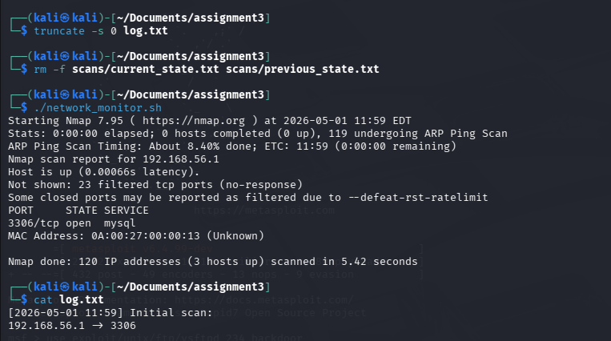

---

### Task 1.2 New Host Detected
This shows Metasploitable appearing on the network.

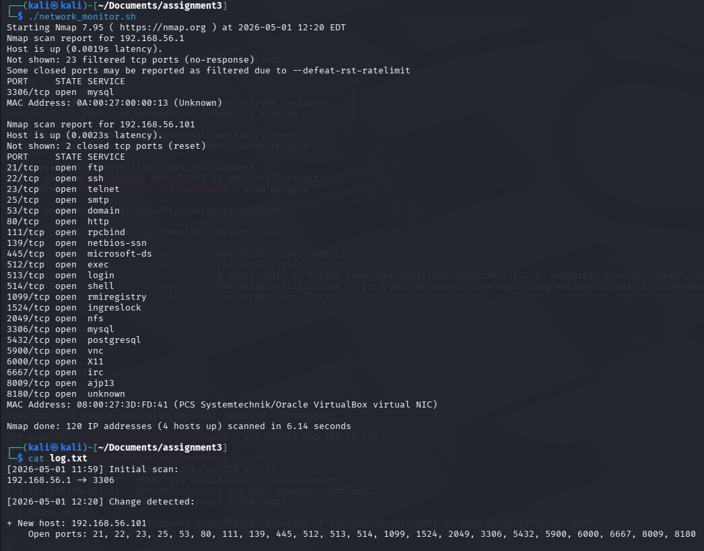

---

### Task 1.3 Port 8080 Opened
This shows port 8080 opening when the web server is started.

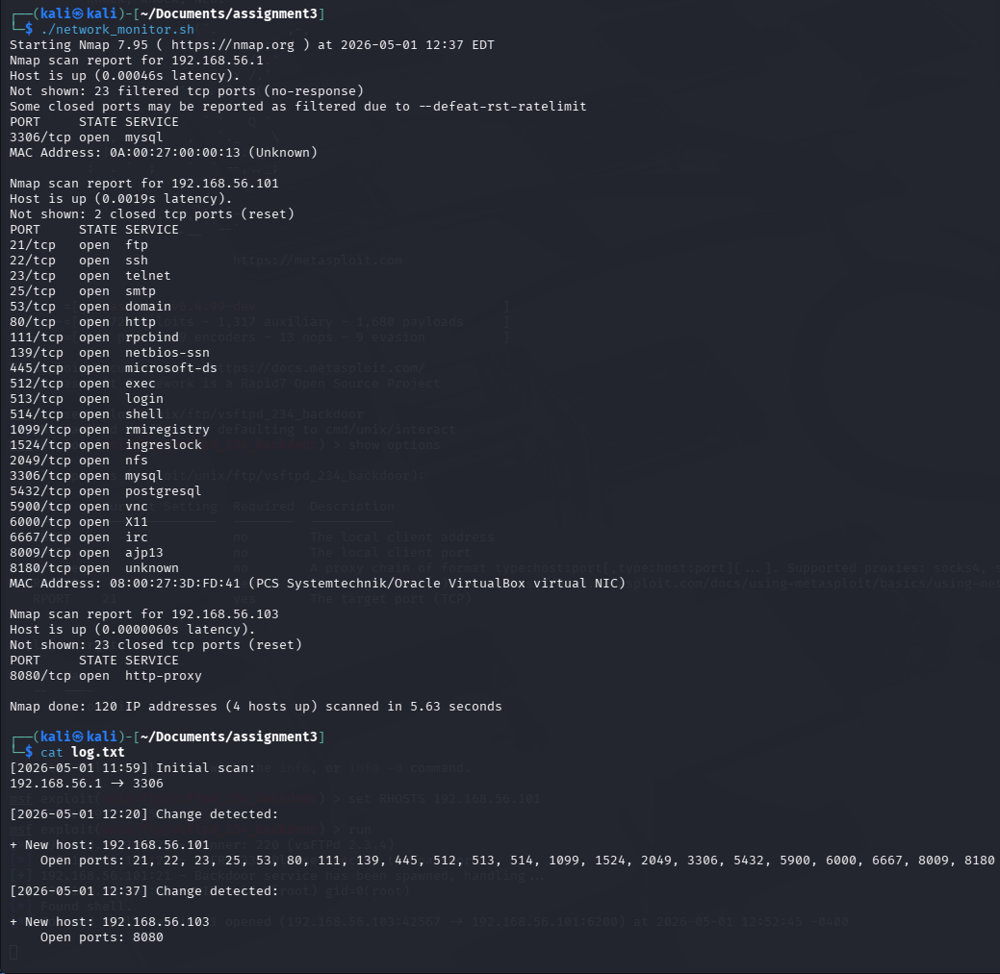

---

### Task 1.4 Port 8080 Closed
This shows port 8080 closing after stopping the server.

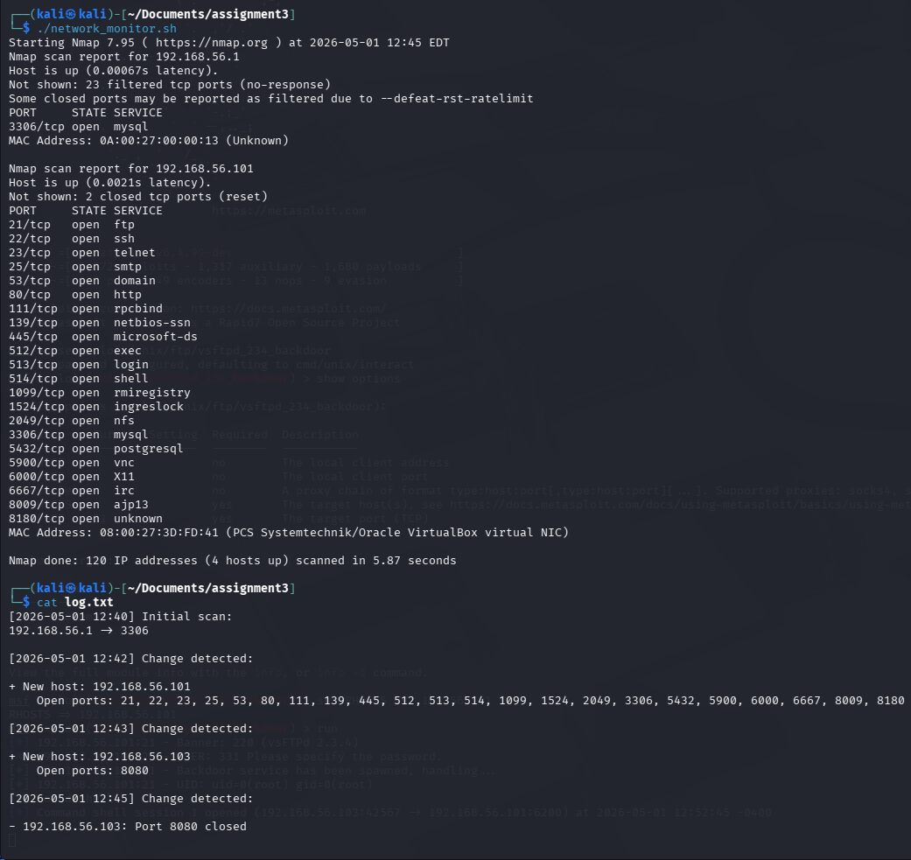

---

### Task 1.5 Port 6200 Opened
This shows port 6200 opening after exploiting the VSFTPD backdoor.

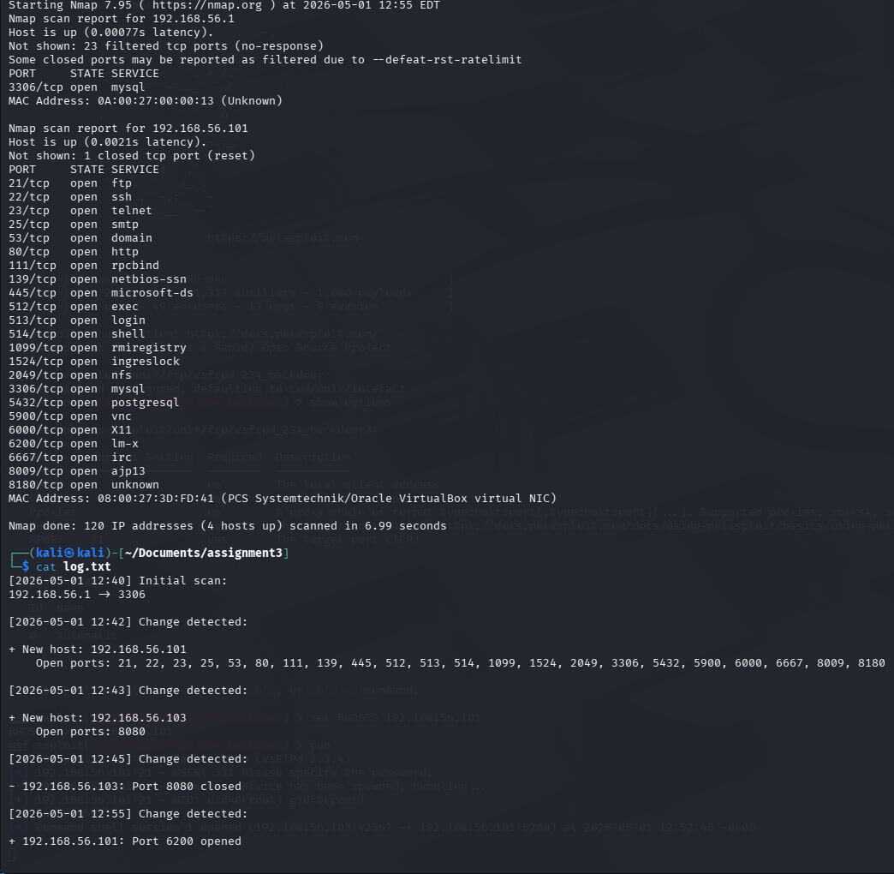

---

## 5. Scenario Summary

During this part of the assignment, I used the monitoring script to observe changes on the lab network. The first scan created a baseline showing the current hosts and open ports. After Metasploitable was powered on, the script detected it as a new host and listed its open services. I then started a Python web server on port 8080, and the script detected that port opening. After stopping the web server, the script detected that port 8080 closed. Finally, after running the VSFTPD exploit against Metasploitable, the script detected port 6200 opening, which showed the backdoor activity.

---

## 6. Limitations and False Positives

One limitation is that the scan only checks the ports listed in the script instead of all 65535 ports. I used this approach because scanning every port on the full subnet took too long in the virtual machine environment. The selected ports still covered the required services for this assignment, including FTP, SSH, HTTP, port 8080, and the VSFTPD backdoor port 6200.

Another limitation is that if a host has no open ports from the selected list, it may not appear in the parsed results. This means the script is best for detecting changes in exposed services rather than proving every host is online. Overall, the script worked for the assignment because it detected new hosts, opened ports, closed ports, and the backdoor port.

# Part 2: Firewall Defense (70 pts)

## 1. Firewall Design

### Overview

In this part, I configured a firewall on VM-D using iptables to protect the system from unauthorized access and common network attacks. The goal was to allow only trusted traffic while blocking or limiting suspicious activity coming from other machines on the network.

### Network Roles

VM-D Defender: 192.168.56.103  
VM-T Trusted Admin: 192.168.56.101  
VM-A Attacker: 192.168.56.104  

### Firewall Strategy

I used a default deny approach where all incoming traffic is dropped unless it is explicitly allowed. This ensures that only necessary and trusted connections are permitted.

I allowed SSH access only from the trusted admin machine. Any SSH attempts from other IP addresses are blocked and logged.

I allowed HTTP traffic but added rate limiting to protect against denial of service attacks. This prevents a system from being overwhelmed by too many requests.

I also implemented ICMP rate limiting to reduce the impact of ping flood attacks.

To protect against scanning and malformed packets, I added rules to detect and drop suspicious TCP flag combinations such as NULL, XMAS, and SYN-FIN scans.

### Screenshots
## Firewall Rules Screenshot

### Key Rules Implemented

- Default DROP policy for all incoming traffic  
- Allow established and related connections  
- Allow SSH only from VM-T  
- Block SSH from all other hosts  
- Allow HTTP with rate limiting  
- Limit ICMP requests  
- Detect and block port scanning attempts  
- Log suspicious activity  

### Validation and Testing

I tested the firewall using VM-A as an attacker machine.

From VM-A, I attempted to:
- Perform port scans using nmap  
- Send ping flood traffic  
- Attempt SSH access  

The firewall successfully blocked unauthorized SSH attempts and limited excessive traffic. Port scans showed that most ports were filtered or protected.

I also verified that trusted access from VM-T was still allowed, confirming that the firewall rules were working correctly without blocking legitimate traffic.

### Logging

The firewall logs suspicious activity using kernel logging. I verified logs using dmesg and observed entries related to rate limiting and blocked traffic, confirming that detection rules were active.

---

## 2. IPTables Rules

In this part, I created a firewall ruleset on VM-D using iptables to control incoming and outgoing traffic. The goal was to follow a secure default deny approach and only allow necessary communication.

The rules were saved using:

sudo iptables-save > rules.txt

This file contains the complete firewall configuration and is included for submission.

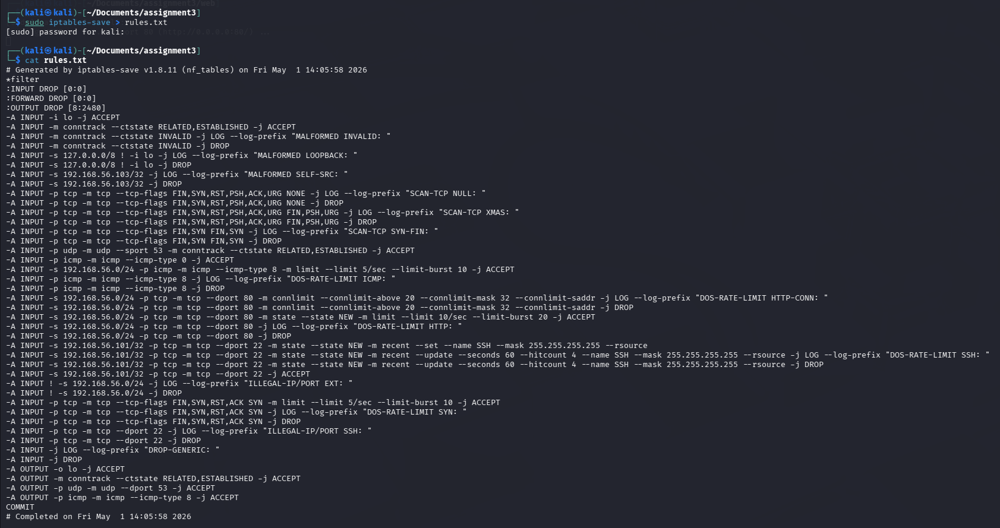

---

## 3. Rule Breakdown

- Default DROP  
I set the default policy to DROP for INPUT, OUTPUT, and FORWARD. This means that all traffic is blocked unless a rule specifically allows it. This is important because it reduces the attack surface and prevents unintended access.

- HTTP allow  
I allowed HTTP traffic on port 80 so that the web server running on VM-D could still be accessed. This ensures that normal services remain functional.

- SSH restriction  
SSH access was restricted to only the trusted admin machine (192.168.56.101). This prevents unauthorized users from attempting to log in remotely. Any SSH attempt from other machines is either blocked or logged.

- Rate limiting  
I applied rate limiting to ICMP, SYN packets, HTTP connections, and SSH attempts. This helps prevent denial of service attacks by limiting how many requests can be processed in a short amount of time.

- Spoof protection  
I added rules to block packets with suspicious or invalid source IP addresses. This includes:
  - loopback spoofing (127.0.0.1 from outside)
  - packets claiming to be from VM-D itself
  - traffic from outside the internal network  
This helps prevent attackers from disguising their identity.

- Logging  
The firewall logs suspicious activity using prefixes such as:
  - DOS-RATE-LIMIT
  - SCAN-TCP
  - MALFORMED
  - DROP-GENERIC  
These logs help identify what type of attack is happening and confirm that the firewall is working.

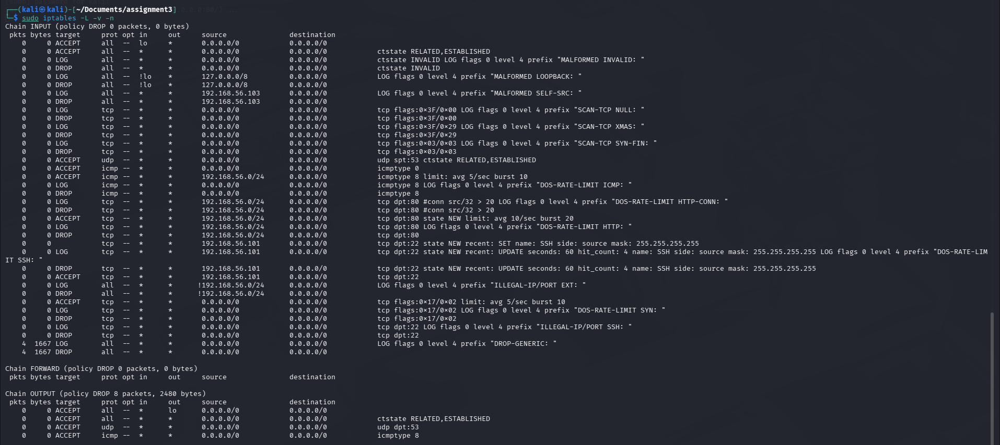

---

## 4. Testing Results

### Test A: ICMP Behavior

- Result: I used `sudo ping -f 192.168.56.103` from VM-A to simulate a ping flood. Even though a large number of packets were sent, the system remained stable and continued responding. This shows that ICMP rate limiting was working correctly.

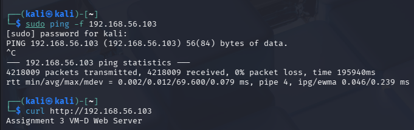

---

### Test B: TCP SYN Flood Detection

- Result: During testing, the firewall logs showed repeated `DOS-RATE-LIMIT SYN` messages. This indicates that SYN flood attempts were being detected and limited. The firewall prevented the system from being overwhelmed by connection requests.

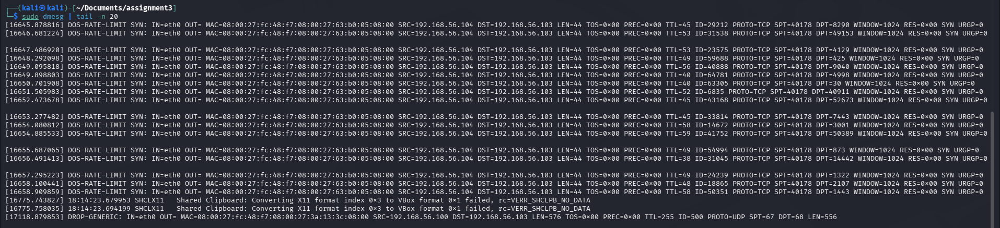

---

### Test C: Port Scan Resistance

- Result: I ran an nmap scan from VM-A. The results showed only a few open ports and many filtered ports. This confirms that the firewall is blocking unauthorized access and limiting what an attacker can discover.

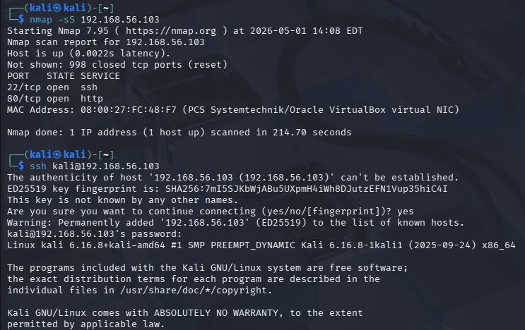

---

### Test D: Spoofed Packet Rejection

- Result: The firewall includes rules to block spoofed packets. Even though I did not manually craft spoofed packets, the configuration ensures that invalid source addresses are detected and dropped.

---

### Test E: Invalid State Packet Handling

- Result: Packets in an invalid state (such as missing SYN handshake) are detected using conntrack rules and dropped. These packets are also logged as MALFORMED traffic.

---

### Test F: Loopback Enforcement

- Result: The firewall blocks packets pretending to come from the loopback address (127.0.0.1) if they do not actually originate from the loopback interface. This prevents attackers from bypassing local-only restrictions.

---

### Test G: UDP Behavior

- Result: UDP traffic such as DNS (port 53) is allowed for normal operation. Other UDP traffic is blocked by default. This ensures necessary services work while reducing unnecessary exposure.

---

### Test H: SSH Access Control

- VM-A (blocked): SSH attempts from the attacker machine were restricted by the firewall. Unauthorized access was prevented.  
- VM-T (allowed): SSH from the trusted admin machine was successful, confirming that access control rules were working correctly.

---

### Test I: HTTP + Flood Protection

- Normal access: I used curl to access the web server, and it returned the expected response, showing that HTTP traffic was allowed.  
- Flood behavior: During flood testing, the system remained responsive because rate limiting controlled excessive traffic.

---

## 5. Log Analysis

I checked firewall logs using:

sudo dmesg | tail -n 20

The logs showed multiple entries such as:

- DOS-RATE-LIMIT SYN  
- DROP-GENERIC  

These logs confirm that the firewall was actively detecting and blocking attack traffic. The source and destination IP addresses also matched the attacker and defender machines, which helped verify that the rules were working correctly.

---

## 6. Observations

- What worked well  
The firewall successfully implemented a secure default deny policy. It allowed necessary services like HTTP and SSH from trusted sources while blocking or limiting malicious traffic. Logging also provided clear visibility into attack attempts.

- Any issues encountered  
Some commands required root privileges, such as the ping flood test. Also, nmap scans took longer due to filtered ports causing timeouts. However, these behaviors were expected and actually show that the firewall is working correctly.

# Part 3: Snort IDS (60 pts)

## 1. Snort Configuration

- Interface used: eth0  
- HOME_NET setting: 192.168.56.0/24  
- Promiscuous mode: Enabled (Snort running in passive sniffing mode)

---

## 2. Custom Rules

    alert tcp any any -> $HOME_NET 80 (msg:"SQL Injection Attempt"; content:"OR 1=1"; http_uri; sid:1000001; rev:1;)
    alert tcp any any -> $HOME_NET 80 (msg:"XSS Attempt"; content:""

- Alert output:
  Snort detected the script tag and triggered the XSS alert.

---

### LFI
- Method used:
  curl "http://192.168.56.103/?file=../../etc/passwd"

- Alert output:
  Snort detected directory traversal patterns and generated alerts.

---

### CSRF
- Method used:
  Simulated request containing csrf related data.

- Alert output:
  Snort generated alerts when matching the CSRF keyword.

---

## 5. Snort Alerts

Sample alerts observed:

    [**] [1:1000001:1] SQL Injection Attempt [**]
    [Priority: 0] {TCP} 192.168.56.104 -> 192.168.56.103:80

    [**] [1:1000002:1] XSS Attempt [**]
    [Priority: 0] {TCP} 192.168.56.104 -> 192.168.56.103:80

    [**] [1:1000003:1] LFI Attempt [**]
    [Priority: 0] {TCP} 192.168.56.104 -> 192.168.56.103:80

    [**] [1:1000012:1] Suspicious ACK Packet [**]
    [Priority: 0] {TCP} 192.168.56.104:41308 -> 192.168.56.103:22

    [**] [1:1000009:1] UDP Packet Detected [**]
    [Priority: 0] {UDP} 192.168.56.101:138 -> 192.168.56.255:138

---

## 6. Analysis

- Which attacks were detected correctly?  
  SQL injection, XSS, and LFI were successfully detected.

- Any missed detections?  
  CSRF detection was limited due to a simple rule.

- False positives?  
  Yes, background traffic like UDP and ACK packets triggered unrelated alerts.

---

## 7. Improvements

- Better rules  
  Use more precise matching or regex patterns.

- More signatures  
  Add community or Emerging Threats rules.

- Performance considerations  
  Optimize rules to reduce unnecessary alerts.

---

# Conclusion

This lab showed how to configure Snort and create IDS rules for web attacks.

- What you learned  
  Writing rules, testing attacks, and analyzing alerts.

- Key challenges  
  Avoiding false positives and syntax issues.

- Improvements  
  More advanced rules and better filtering.

---

# Screenshots

## Task 3.1 – Snort Version
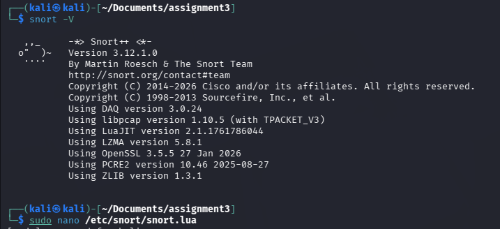

## Task 3.2 – Configuration
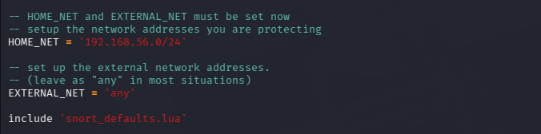

## Task 3.3 – Snort Startup
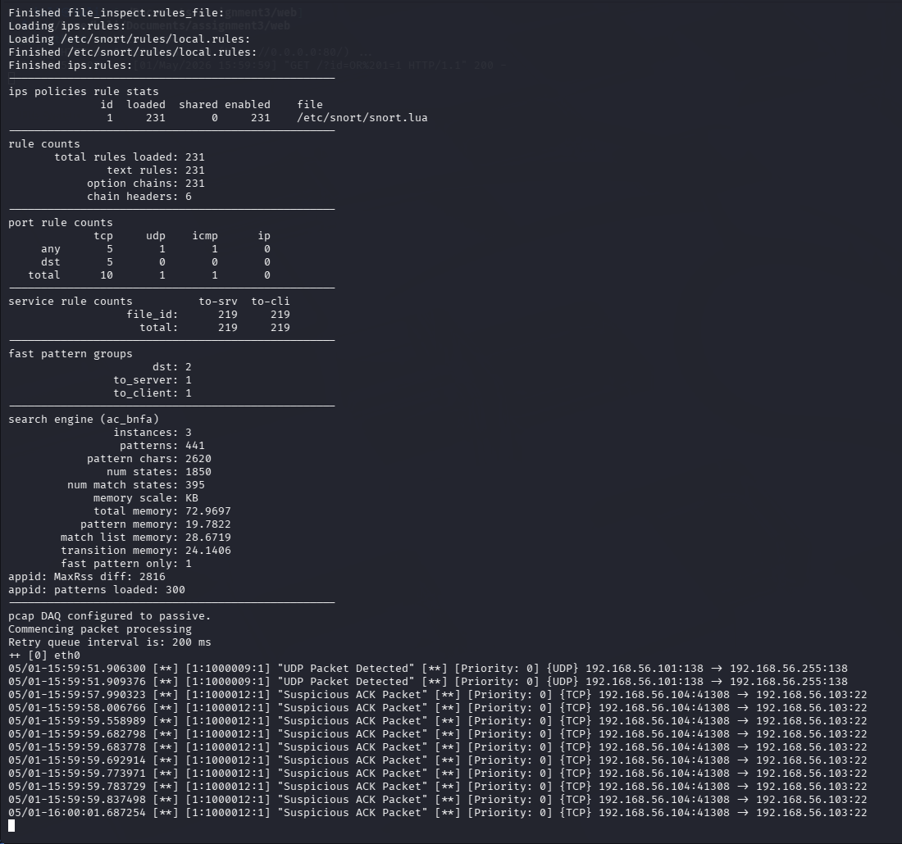

## Task 3.4 – Snort Running
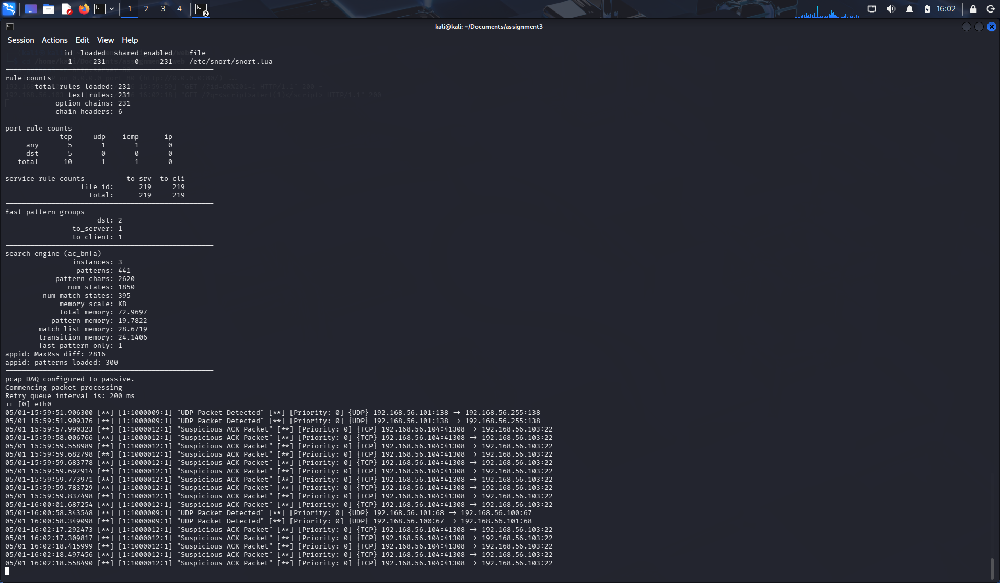

## Task 3.5 – Attack Testing
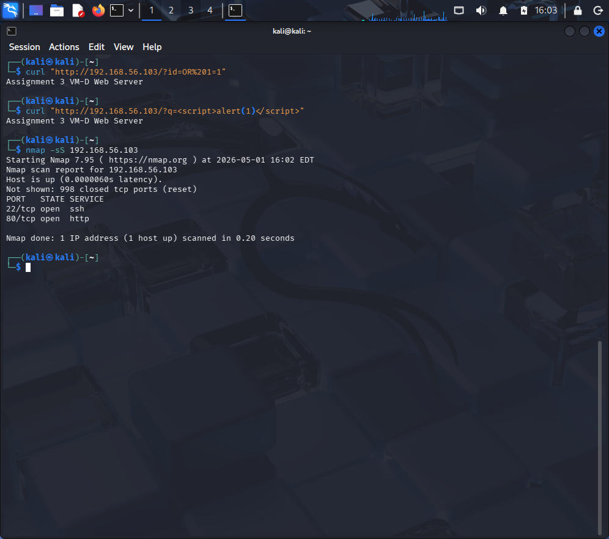

## Task 3.6 – Alerts Output
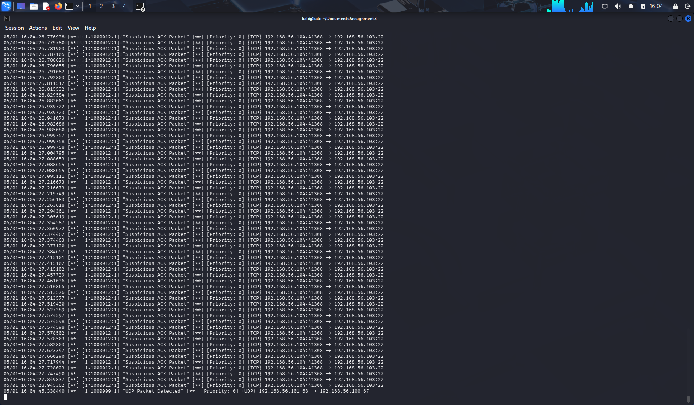

## Task 3.7 – Nmap Scan
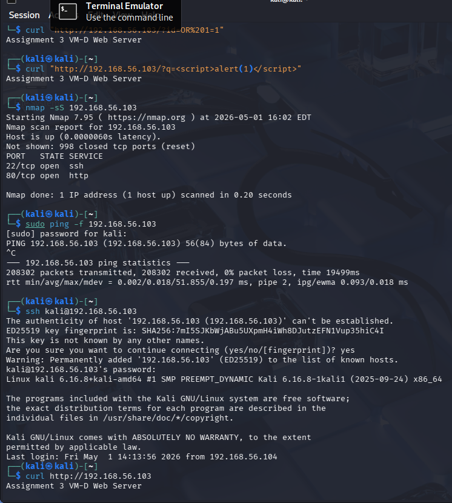

## Task 3.8 – Connectivity Test
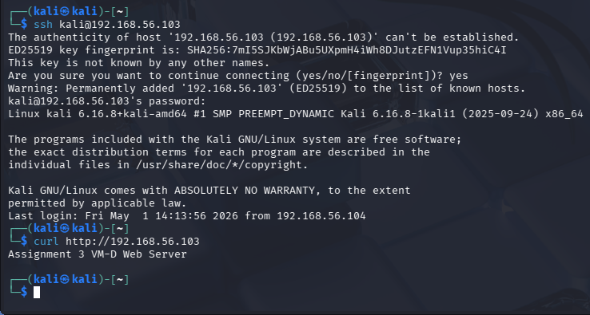